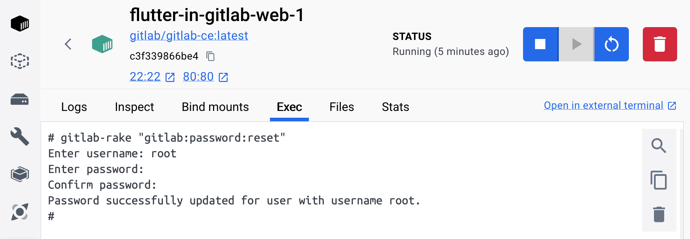
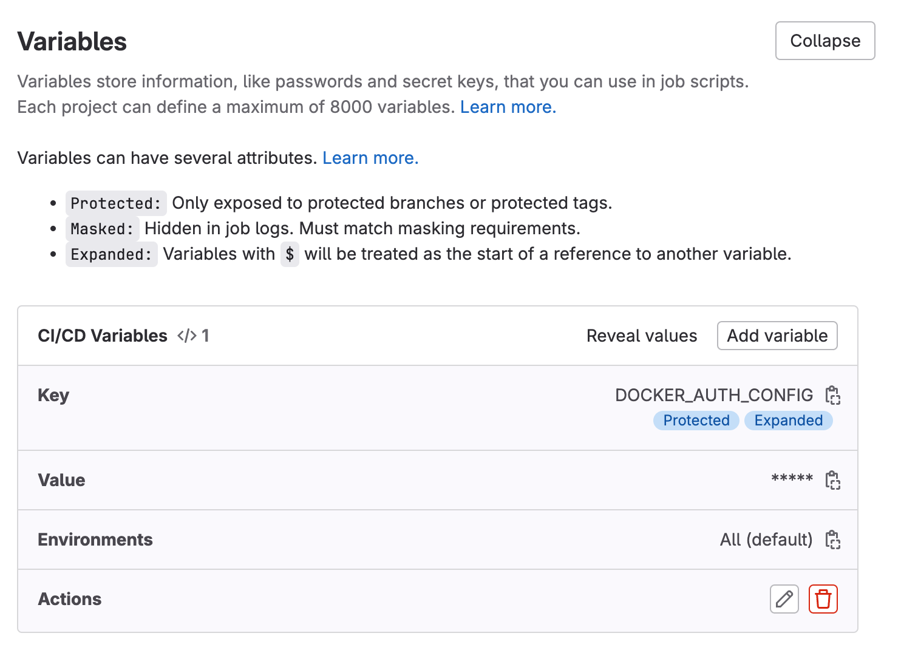
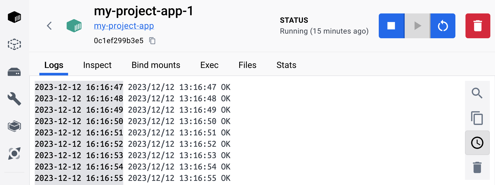
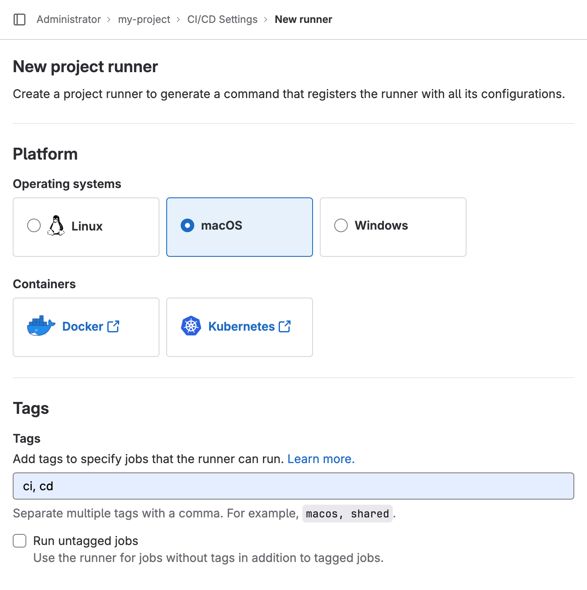
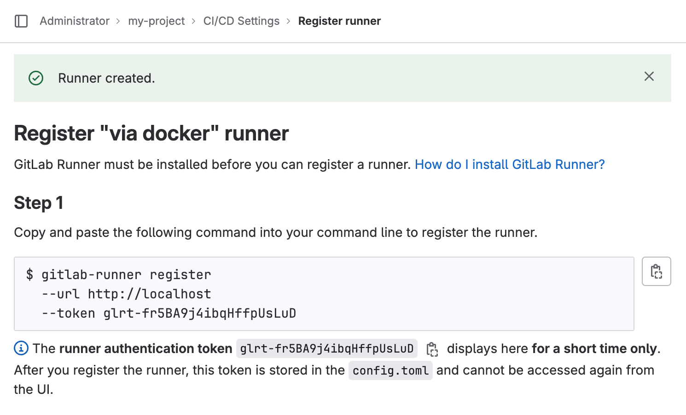
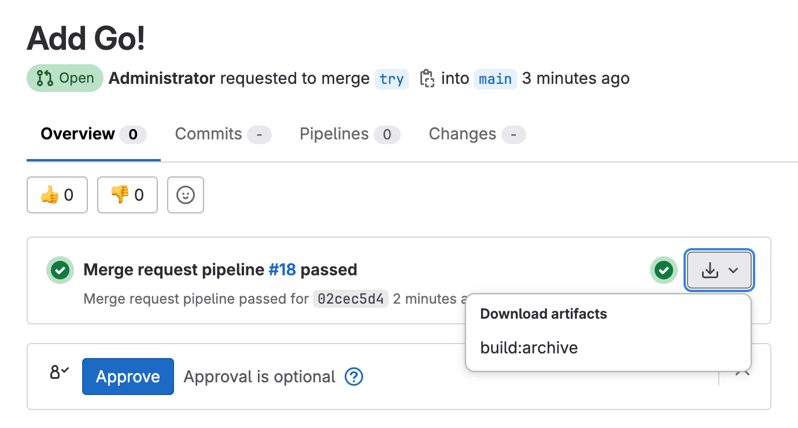

# Инструкция: как поднять GitLab CI/CD на GoLang-проекте


В продолжение к заметке [Инструкция: как быстро настроить GitLab CI/CD на Flutter-проекте](https://habr.com/ru/companies/agima/articles/779028/).

Больше спасибо автору, всё получилось относительно легко. Я усложнил задачу: поднял GitLab локально на Хакинтоше, прикрутил `executor = "docker"` вместо `"shell"`. И началось веселье.

## Docker Desktop

Не повторяйте мою ошибку: сначала сохраните данные, если есть наработки в Docker-образах. Установливаю с официального сайта, через скачанный Docker.dmg [v4.25.2](<(https://docs.docker.com/desktop/release-notes/#4252)>):

```bash
$ docker -v
Docker version 24.0.6, build ed223bc
$ docker-compose version
Docker Compose version v2.23.0-desktop.1
```

## Локальная установка GitLab в Docker

```yaml
# docker-compose.yml
version: '3'
services:
  web:
    image: 'gitlab/gitlab-ce:latest'
    restart: always
    hostname: 'localhost'
    environment:
      GITLAB_OMNIBUS_CONFIG: |
        external_url 'http://localhost'
    ports:
      - '80:80'
      # - '443:443'
      - '22:22'
    volumes:
      - '~/.gitlab/config:/etc/gitlab'
      - '~/.gitlab/logs:/var/log/gitlab'
      - '~/.gitlab/data:/var/opt/gitlab'
```

```bash
$ docker-compose up -d
```

Пошуршит пару минут, потом доступен по адресу `http://localhost`. Сбрасываю пароль:



Если пароль был сохранён ранее для входа в `git` через VSCode, тоже можно сбросить:

```bash
$ git credential-osxkeychain erase host=localhost protocol=http
```

## DOCKER_AUTH_CONFIG

Проверяю доступ к аккаунту в docker.io:

```bash
$ docker logout
$ docker login
Login Succeeded
```

Генерирую хэш:

```bash
$ printf "my_username:my_password" | openssl base64 -A
# Example output to copy
bXlfdXNlcm5hbWU6bXlfcGFzc3dvcmQ=
```

Добавляю хэш в конфиг:

```bash
$ nano ~/.docker/config.json
```

```json
{
  "auths": {
    "docker.io": {
      "auth": "bXlfdXNlcm5hbWU6bXlfcGFzc3dvcmQ="
    }
  },
  "credsStore": "desktop",
  "currentContext": "desktop-linux",
  "plugins": {
    "-x-cli-hints": {
      "enabled": "true"
    }
  }
}
```

Прописываю `DOCKER_AUTH_CONFIG`:

```json
{
  "auths": {
    "docker.io": {
      "auth": "bXlfdXNlcm5hbWU6bXlfcGFzc3dvcmQ="
    }
  }
}
```



## Рыба проекта

Создаю новый проект в интерфейсе GitLab и клонирую его к себе:

```bash
$ git clone http://localhost/root/my-project.git
$ cd my-project
```

Пора добавить божественный `main.go`:

```bash
$ go mod init my-project
$ nano main.go
```

```go
package main

import (
	"log"
	"time"
)

func main() {
	for {
		time.Sleep(time.Second)
		log.Println("OK")
	}
}
```

Мне нужен `Dockerfile` для локальной сборки:

```bash
$ nano Dockerfile
```

```Dockerfile
FROM golang:onbuild AS build
WORKDIR /build
COPY . .
RUN CGO_ENABLED=0 GOARCH=amd64 GOOS=linux go build -o ./app

FROM ubuntu:20.04 AS ubuntu
RUN apt-get update
RUN DEBIAN_FRONTEND=noninteractive apt-get install -y upx
RUN apt-get clean && \
    rm -rf /var/lib/apt/lists/*
COPY --from=build /build/app /build/app
RUN upx /build/app

FROM scratch
COPY --from=ubuntu /build/app /build/app

ENTRYPOINT ["/build/app"]
```

Вся эта суета, чтобы получить образ (image) на 577KB:

- `ubuntu` применяет волшебный [upx](https://github.com/upx/upx);
- `scratch` тоже сокращает итоговый размер.

И для порядка:

```bash
$ nano .dockerignore
```

Содержимое:

```ini
.git
```

Вишенка на торте:

```bash
$ nano docker-compose.yml
```

```yaml
version: '3'
name: 'my-project'
services:
  app:
    build: .
```

Пробую запустить в докере:

```bash
$ docker-compose up -d --build
```



## gitlab-runner

Установка:

```bash
$ brew install gitlab-runner
$ brew services start gitlab-runner
```

Добавляю теги 'ci, cd':



И получаю токен:



Выполняю регистрацию:

```bash
$ gitlab-runner register \
 --url "http://localhost" \
 --description "via docker" \
 --docker-image "alpine" \
 --executor "docker" \
 --docker-privileged \
 --docker-volumes "/certs/client" \
 --docker-network-mode host \
 --docker-helper-image "registry.gitlab.com/gitlab-org/gitlab-runner/gitlab-runner-helper:x86_64-e0218c92"
```

Открываю на редактирование `config.toml`:

```bash
$ nano ~/.gitlab-runner/config.toml
```

Удаляю значение для ключа `image`:

```ini
[[runners]]
  name = "via docker"
  # ...
  [runners.docker]
    image = ""
    # ...
```

## .gitlab-ci.yml

```bash
$ nano .gitlab-ci.yml
```

**Я:** Как перевести `Dockerfile` в формат `.gitlab-ci.yml`?

```Dockerfile
FROM golang:onbuild AS build
WORKDIR /build
COPY . .
RUN CGO_ENABLED=0 GOARCH=amd64 GOOS=linux go build -o ./app
```

**ChatGPT:**

```yaml
stages:
  - build

variables:
  GOARCH: amd64
  GOOS: linux
  CGO_ENABLED: 0

build:
  stage: build
  image: golang:onbuild
  script:
    - go build -o ./app
  artifacts:
    paths:
      - ./app
```

Добавляю от себя:

```yaml
  tags:
    - cd

workflow:
  rules:
    - if: '$CI_PIPELINE_SOURCE == "merge_request_event"'
      when: always
```

Всё, можно коммитить. Прямо ветку `main`, как мы любим. Потом делаю новую ветку с каким-либо изменением и оформляю "merge request".

Запущенный job выполнен успешно, можно скачать результат:



**UPD:** решил вопросы с запуском `gitlab-runner` и отказался от Docker Desktop 4.26.0.

---

```yaml
version: '3.5'
name: gitlab-runner
services:
  runner:
    restart: always
    image: registry.gitlab.com/gitlab-org/gitlab-runner:alpine
    volumes:
      - /var/run/docker.sock:/var/run/docker.sock
      - ~/.gitlab-runner:/etc/gitlab-runner
    network_mode: host
```

Ларчик просто открывался. Это всё, что нужно для запуска gitlab-runner без танцев с бубном.

---

Это позволяет запускать задания GitLab CI/CD в отдельных, изолированных контейнерах Docker. Вот пример конфигурации `docker-compose.yml` для GitLab Runner:

```yaml
version: '3.5'
services:
  dind:
    image: docker:20-dind
    restart: always
    privileged: true
    environment:
      DOCKER_TLS_CERTDIR: ''
    command:
      - --storage-driver=overlay2
  runner:
    restart: always
    image: registry.gitlab.com/gitlab-org/gitlab-runner:alpine
    depends_on:
      - dind
    environment:
      - DOCKER_HOST=tcp://dind:2375
    volumes:
      - ./config:/etc/gitlab-runner:z
  register-runner:
    restart: 'no'
    image: registry.gitlab.com/gitlab-org/gitlab-runner:alpine
    depends_on:
      - dind
    environment:
      - CI_SERVER_URL=${CI_SERVER_URL}
      - REGISTRATION_TOKEN=${REGISTRATION_TOKEN}
    command:
      - register
      - --non-interactive
      - --locked=false
      - --name=${RUNNER_NAME}
      - --executor=docker
      - --docker-image=docker:20-dind
      - --docker-volumes=/var/run/docker.sock:/var/run/docker.sock
    volumes:
      - ./config:/etc/gitlab-runner:z
```

Вам также потребуется файл `.env` со следующим содержимым:

```bash
RUNNER_NAME=RUNNER-NAME
REGISTRATION_TOKEN=TOKEN
CI_SERVER_URL=https://gitlab.com/
```

Пожалуйста, замените `RUNNER_NAME`, `REGISTRATION_TOKEN`, и `CI_SERVER_URL` на соответствующие значения для вашего проекта.
