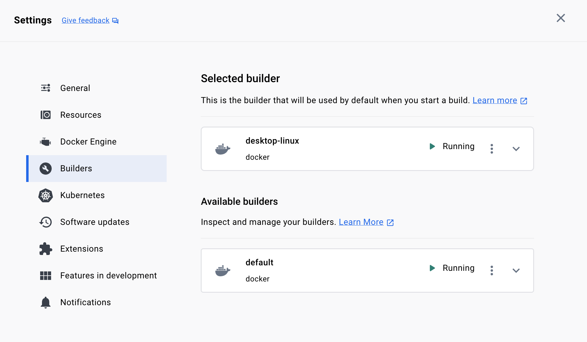

# Инструкция: как поднять GitLab CI/CD на Маке со сборкой в Docker на GoLang-проекте


В продолжение к заметке [Инструкция: как быстро настроить GitLab CI/CD на Flutter-проекте](https://habr.com/ru/companies/agima/articles/779028/).

Больше спасибо автору, всё получилось относительно легко. Я усложнил задачу: поднял GitLab локально на Хакинтоше, прикрутил `executor = "docker"` вместо `"shell"`. И началось веселье.

## Docker Desktop

Актуальная версия 4.26.0. Не повторяйте мою ошибку: сначала сохраните данные, если есть наработки в Docker-образах. Попробовал обновить с официального сайта, через скачанный [Docker.dmg](https://docs.docker.com/desktop/install/mac-install/) - почему-то больше не работают в консоли команды `docker` и `docker-compose`. Хорошо, поставлю через Homebrew:

```bash
$ brew install --cask docker
$ docker -v
Docker version 24.0.7, build afdd53b
$ docker-compose version
Docker Compose version v2.23.3-desktop.2
```

Но есть вопрос:


Не знаю, как решить красиво. А пока приходится каждый раз при перезагрузке компа:

```bash
$ sudo ln -s ~/Library/Containers/com.docker.docker/Data/docker.raw.sock /var/run/docker.sock
```



## Локальная установка GitLab в Docker

```yml
# docker-compose.yml
version: '3'
services:
  web:
    image: 'gitlab/gitlab-ce:latest'
    restart: always
    hostname: 'localhost'
    environment:
      GITLAB_OMNIBUS_CONFIG: |
        external_url 'http://localhost'
    ports:
      - '80:80'
      # - '443:443'
      - '22:22'
    volumes:
      - '~/.gitlab/config:/etc/gitlab'
      - '~/.gitlab/logs:/var/log/gitlab'
      - '~/.gitlab/data:/var/opt/gitlab'
```

```bash
$ docker-compose up -d
```

Пошуршит пару минут, потом доступен по адресу `http://localhost`. Сбрасываю пароль:


Если пароль был сохранён ранее для входа в `git` через VSCode, тоже можно сбросить:

```bash
$ git credential-osxkeychain erase host=localhost protocol=http
```

## Рыба проекта

Создаю новый проект в интерфейсе GitLab и клонирую его к себе:

```bash
$ git clone http://localhost/root/my-project.git
$ cd my-project
```

Пора добавить божественный `main.go`:

```bash
$ go mod init my-project
$ touch main.go
```

```go
package main

import (
	"log"
	"time"
)

func main() {
	for {
		time.Sleep(time.Second)
		log.Println("OK")
	}
}
```

Мне нужен Dockerfile для локальной сборки:

```Dockerfile
FROM golang:onbuild AS build
WORKDIR /build
COPY . .
RUN CGO_ENABLED=0 GOARCH=amd64 GOOS=linux go build -o ./app

FROM ubuntu:20.04 AS ubuntu
RUN apt-get update
RUN DEBIAN_FRONTEND=noninteractive apt-get install -y upx
RUN apt-get clean && \
    rm -rf /var/lib/apt/lists/*
COPY --from=build /build/app /build/app
RUN upx /build/app

FROM scratch
COPY --from=ubuntu /build/app /build/app

ENTRYPOINT ["/build/app"]
```

Вся эта суета, чтобы получить образ (image) на 577KB:

- `ubuntu` применяет волшебный [upx](https://github.com/upx/upx);
- `scratch` тоже сокращает итоговый размер.

Для порядка:

```bash
$ touch .dockerignore
```

Содержимое:

```ini
.git
```

Пробую запустить в докере:

```bash
$ docker-compose up -d --build
```


## gitlab-runner

Установка:

```bash
$ brew install gitlab-runner
```

У меня не работает как сервис. Пока приходится каждый раз при перезагрузке компа:

```bash
$ sudo gitlab-runner run
```

Добавляю теги 'ci, cd':


И получаю токен:


Выполняю регистрацию:

```bash
$ sudo gitlab-runner register \
 --url "http://localhost" \
 --description "via docker" \
 --docker-image "alpine" \
 --executor "docker" \
 --docker-privileged \
 --docker-volumes "/certs/client" \
 --docker-network-mode host \
 --docker-helper-image "registry.gitlab.com/gitlab-org/gitlab-runner/gitlab-runner-helper:x86_64-e0218c92"
```

Открываю на редактирование `config.toml`:

```bash
$ sudo nano /etc/gitlab-runner/config.toml
```

Удаляю значение для ключа `image`:

```ini
[[runners]]
  name = "via docker"
  # ...
  [runners.docker]
    image = ""
    # ...
```

## .gitlab-ci.yml

```bash
$ touch .gitlab-ci.yml
```

**Я:** Как перевести `Dockerfile` в формат `.gitlab-ci.yml`?

```Dockerfile
FROM golang:onbuild AS build
WORKDIR /build
COPY . .
RUN CGO_ENABLED=0 GOARCH=amd64 GOOS=linux go build -o ./app
```

**ChatGPT:**

```yml
stages:
  - build

variables:
  GOARCH: amd64
  GOOS: linux
  CGO_ENABLED: 0

build:
  stage: build
  image: golang:onbuild
  script:
    - go build -o ./app
  artifacts:
    paths:
      - ./app
```

Добавляю от себя:

```yml
  tags:
    - cd

workflow:
  rules:
    - if: '$CI_PIPELINE_SOURCE == "merge_request_event"'
      when: always
```

Всё, можно коммитить. Прямо ветку `main`, как мы любим. Потом делаю новую ветку с каким-либо изменением и оформляю "merge request".

В терминале, где запущен `gitlab-runner`, наблюдаю непонятное:

```
WARNING: Failed to exec create to container: Error response from daemon: Container 62bd11eb66c8076b5450643026533548187e5e232041d49f88f91b040f8601c5 is not running (docker.go:1230:0s)  error
```

Однако job выполняется успешно:


Осталось проверить результат. Ой, а бинарник собран под Ubuntu. Пришлось опять же докер городить. Оно работает!
